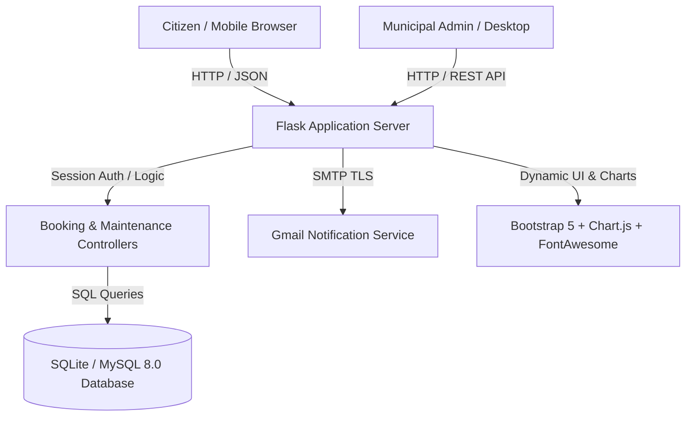
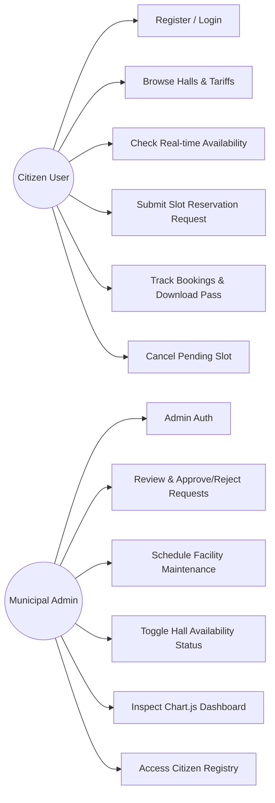
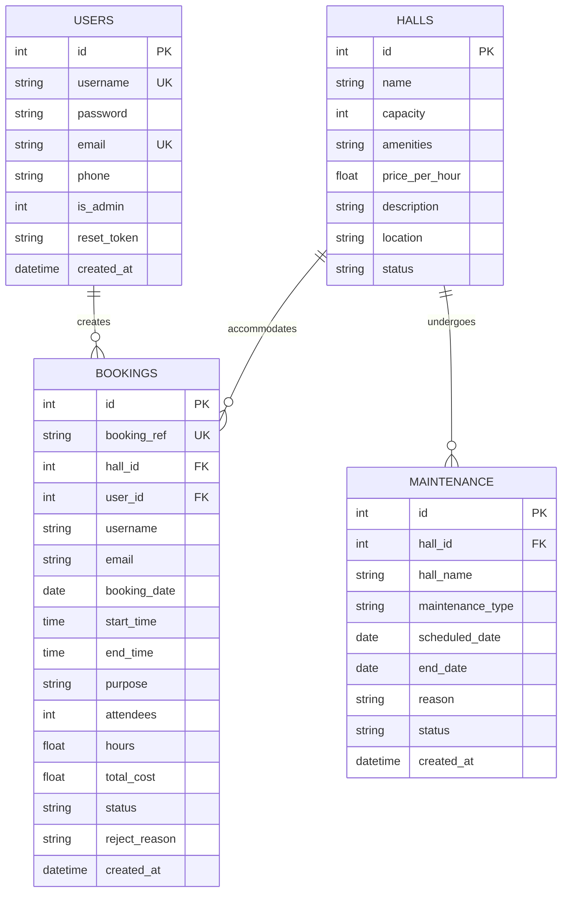
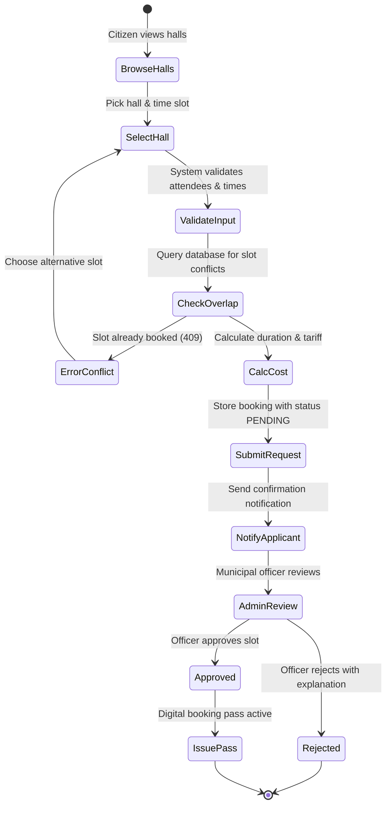

# Community Hall Booking & Management System
## VTU Community Project Report & Engineering Documentation
**Project Title:** Community Hall Booking & Management System  
**Category/Project ID:** Project #78 (Track A: Web)  
**Program Outcome (PO):** PO 6 (The Engineer and Society)  
**Sustainable Development Goal (SDG):** SDG 11: Sustainable Cities and Communities  

---

### 1. Executive Summary & Problem Formulation
Civic community halls play a pivotal role in urban and rural municipalities, serving as primary hubs for cultural assemblies, self-help group gatherings, public grievance sessions, wedding celebrations, and youth workshops. However, the conventional reservation workflow is plagued by:
- **Manual, Paper-Based Register Management:** Vulnerable to human error, double-booking conflicts, and opaque pricing.
- **Lack of Availability Visibility:** Citizens are forced to physically travel to administrative offices simply to check slot open dates.
- **Unscheduled Maintenance & Facility Degradation:** Unmonitored downtime without public notifications.
- **Inequitable Resource Access:** Absence of digital tracking hinders marginalized social sectors from securing fair municipal allocations.

**Engineering Objective:**
To architect and deploy a robust, responsive web application that digitizes community hall reservation, prevents booking overlaps algorithmically, empowers municipal administrators with decision controls (Approve/Reject with feedback), schedules preventive facility maintenance, maintains indelible digital booking histories, and presents interactive visual metrics via Chart.js.

---

### 2. Alignment with PO 6 and SDG 11

| Standard / Target | Application Alignment |
|---|---|
| **PO 6: The Engineer and Society** | Applies engineering principles to evaluate civic societal issues. Ensures equitable, transparent distribution of public municipal infrastructure without monopolistic exploitation or nepotism. |
| **SDG 11: Target 11.7 (Inclusive Public Spaces)** | Delivers universal access to safe, inclusive, accessible green and public spaces for community bonding, youth training, and civic engagements. |
| **SDG 11: Target 11.3 (Sustainable Urbanization)** | Enhances participatory, integrated municipal management and digital governance. |

---

### 3. System Architecture & Tech Stack



- **Backend:** Python 3.14 + Flask 3.1
- **Database:** Dual support for MySQL 8.0 (`database/schema_mysql.sql`) and SQLite 3 (`database/community_hall.db`)
- **Frontend:** HTML5, CSS3, Vanilla JavaScript, Bootstrap 5.3, Chart.js 4.4, FontAwesome 6
- **Architecture:** Model-View-Controller (MVC) with modular database abstraction layer (`db.py`)
- **Network Interface:** Bound to `0.0.0.0:5000` for seamless local LAN access from smartphones.

---

### 4. UML & Database Diagrams

#### 4.1 Use Case Diagram


#### 4.2 Entity-Relationship (ER) Diagram


#### 4.3 Activity Diagram (Booking Process)


---

### 5. REST API Documentation (For Postman Testing)

| HTTP Method | Endpoint | Description | Payload Sample | Status Code |
|---|---|---|---|---|
| `GET` | `/api/halls` | List all community halls | None | 200 OK |
| `GET` | `/api/halls/<id>` | Retrieve specific hall details | None | 200 OK / 404 |
| `GET` | `/api/bookings` | List all active bookings (filter by `user_id` query param) | None | 200 OK |
| `POST` | `/api/bookings` | Create new slot reservation | `{"hall_id": 1, "booking_date": "2026-11-20", "start_time": "10:00", "end_time": "13:00", "purpose": "Workshop", "attendees": 50}` | 201 Created / 409 Conflict |
| `GET` | `/api/bookings/<id>` | Retrieve single booking record | None | 200 OK / 404 |
| `PUT` | `/api/bookings/<id>` | Update booking status (`approved`, `rejected`, `cancelled`) | `{"status": "approved", "reason": ""}` | 200 OK / 400 |
| `DELETE`| `/api/bookings/<id>`| Remove booking record | None | 200 OK |
| `GET` | `/api/analytics`| Retrieve Chart.js aggregation data | None | 200 OK |

---

### 6. Testing & Quality Assurance
A comprehensive unit and integration test suite is located in `test/test_api.py`.
Execution command:
```bash
python test/test_api.py
```
**Test Coverage Includes:**
- GET `/api/halls` status code and list count verification.
- GET single hall retrieval.
- POST reservation creation with automatic tariff calculation.
- Algorithmic conflict prevention (409 Conflict assertion).
- Administrative status modification via PUT.
- Telemetry endpoint validation.
